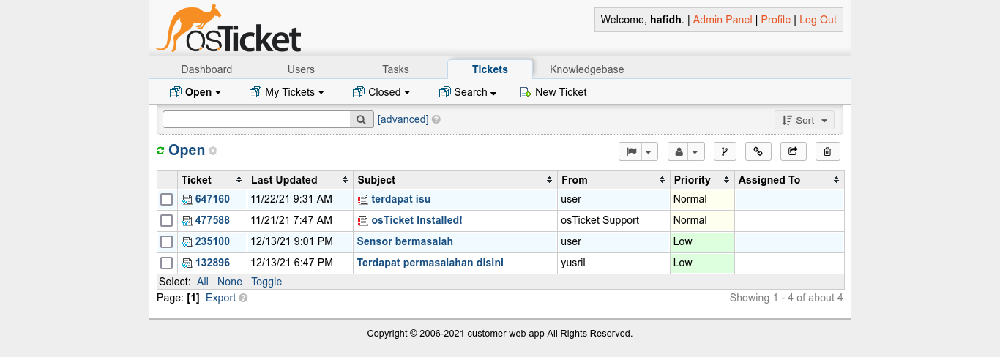

# Report

Untuk melihat report kita diperlukan login dahulu dan kemudian di arahkan ke halaman list report seperti gambar di bawah ini&#x20;

Untuk mengetahui kejelasan tentang salah satu report bisa menekan salah satu subject report dan kemudian diarahkan ke halaman di bawah ini&#x20;

di dalam detail ini admin dapat mengisikan reply permasalahannya, kemudian dapat mengubah status dari laporan tersebut dengan menekan dropdown list kemudian dapat memilih sudah **resolved** atau dan **closed** atau msih **open** seperti sekarang.

### Closed

Untuk melihat permasalahan yang sudah di kerjakan dapat menekan tombol  kemudian akan menampilkan list yang sudah di kerjakaan

### Open

Untuk ticket yang masih open bisa menekan tombol  kemudian akan menampilkan list dari ticket yang msih open&#x20;

