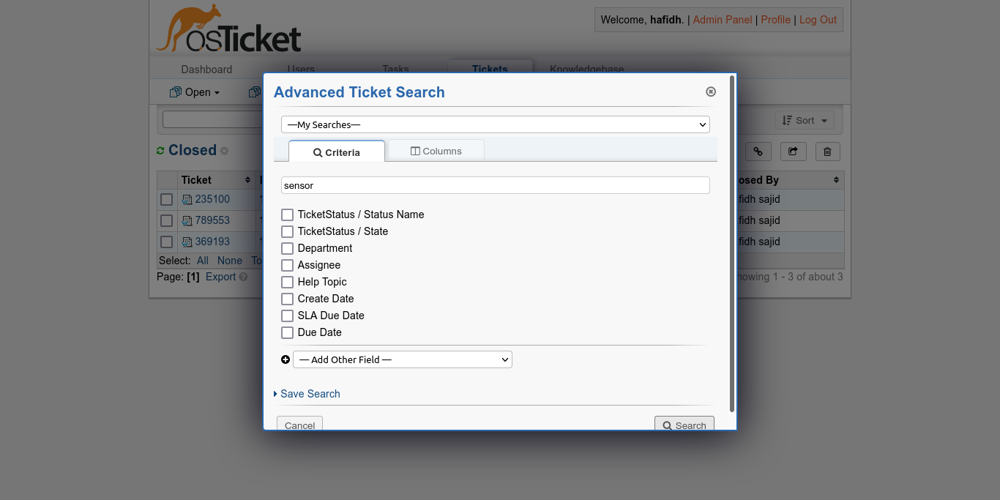

# Search

Admin dapat melakukan pencarian dengan menggunaakan fitur search pada osticket ini caranya yaitu dengan menekan tombol  kemudian akan memunculkan popup window&#x20;

sebagai contoh untuk melakukan pencarian **sensor** kemudian menekan tombol setelah itu akan diarahkan ke halaman hasil pencarian seperti gambar di bawah ini

