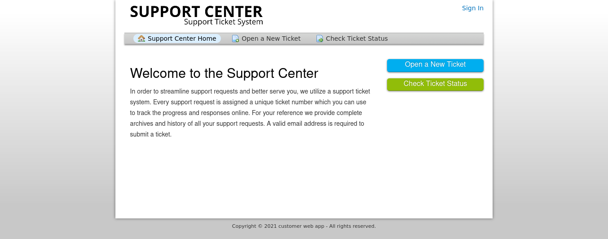
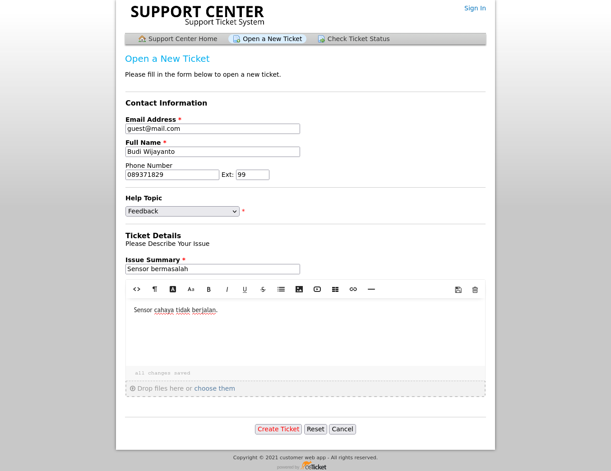

# Pelaporan oleh user

### Halaman Awal

Berikut ini adalah tampilan awal dari OsTicket

Untuk melakukan report bisa menekan tombol  kemudian akan diarahkan ke halaman seperti di bawah ini. dan kemudian dapat mengisikan form sesuai yang dibutuhkan.&#x20;

Setelah itu menekan tombol  dan kemudian permasalahan tersebut akan disimpan di database sistem.
